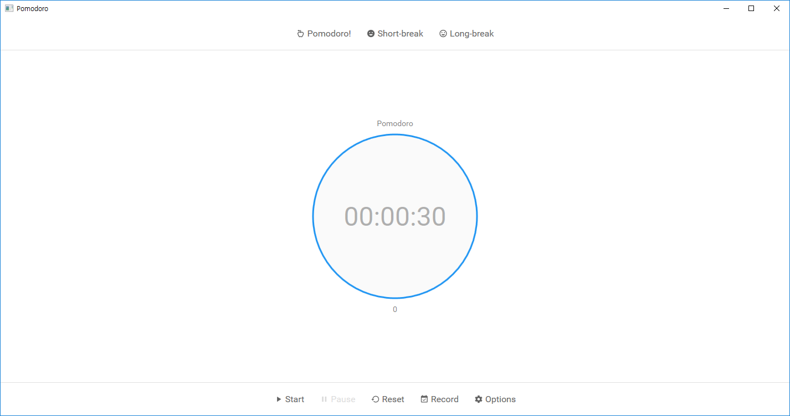
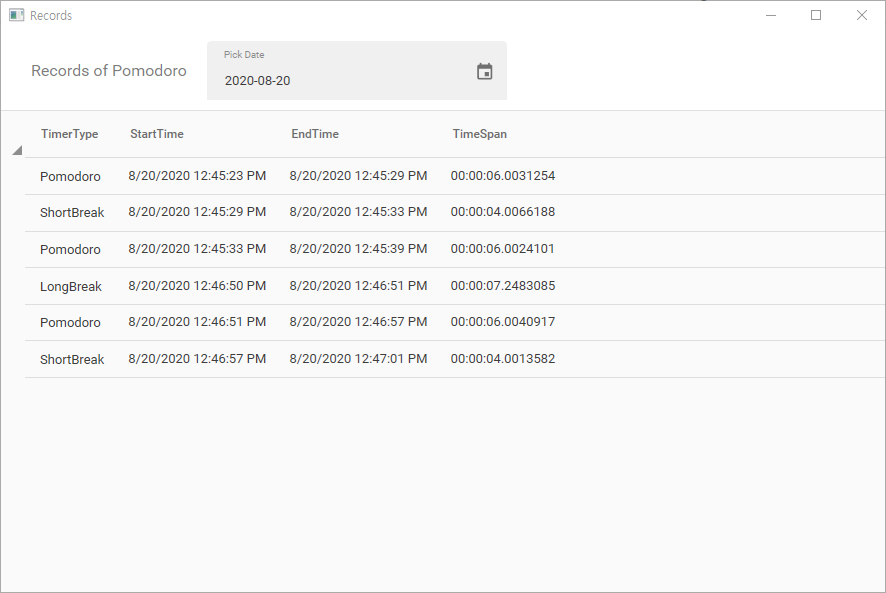

# Pomodoro
## Introduction
Pomodoro is a simplest, but powerful pomodoro timer. This application has developed based on MVVM Pattern in WPF.

## Screenshots

## Open-Source Licenses
Everyone can use the source code in this repository freely, under the MIT License.
 * MaterialDesignInXaml - MIT License [[View License]](https://github.com/MaterialDesignInXAML/MaterialDesignInXamlToolkit/blob/master/LICENSE)
 * NAudio - Microsoft Public License [[View License]](https://github.com/naudio/NAudio/blob/master/license.txt)
 * Json.NET - MIT License [[View License]](https://github.com/JamesNK/Newtonsoft.Json/blob/master/LICENSE.md)

## Contact
if you have a question about the source code, please contact with me using GitHub Issues.
